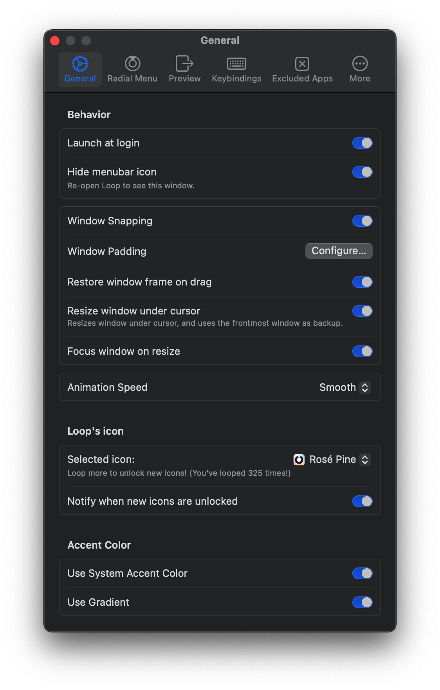
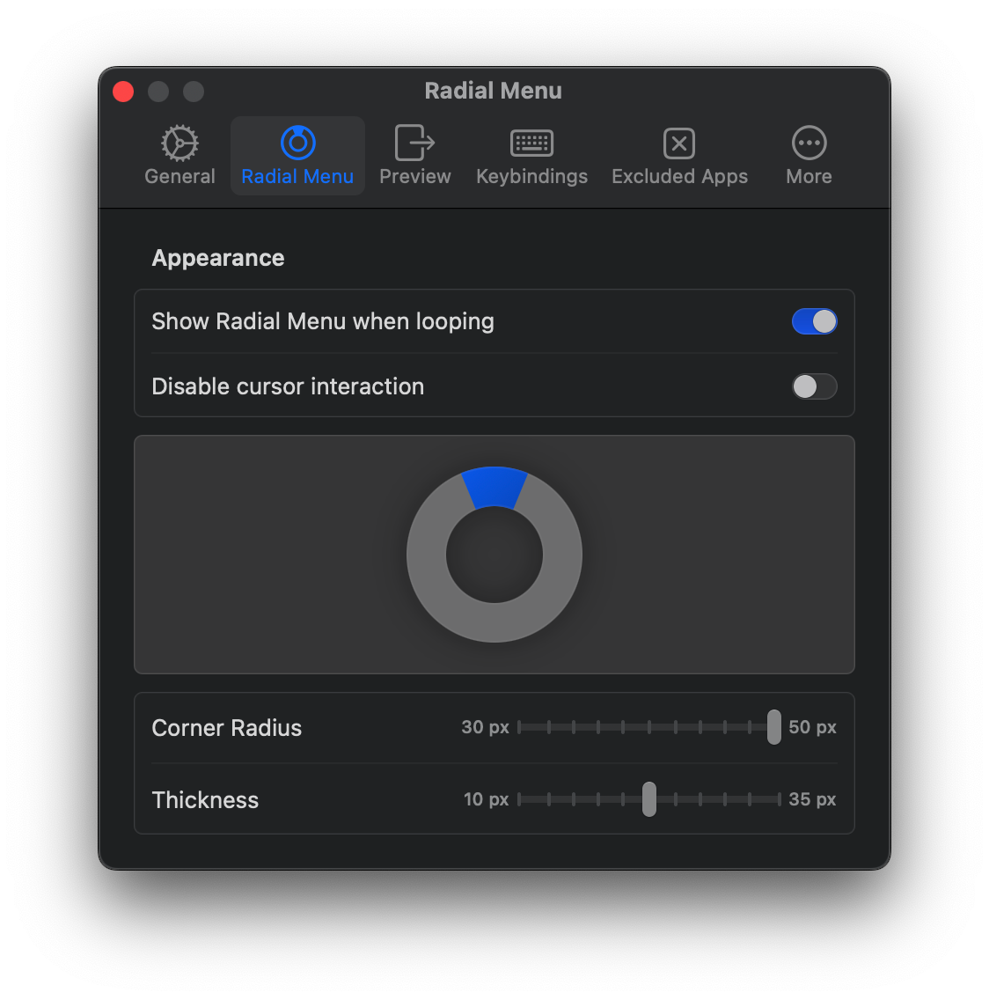
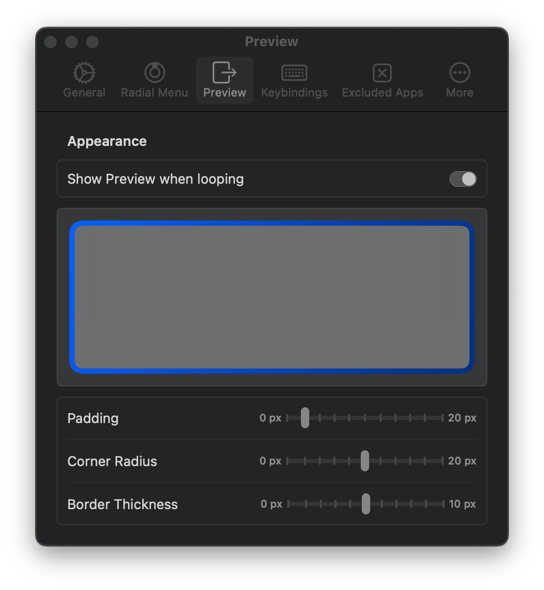
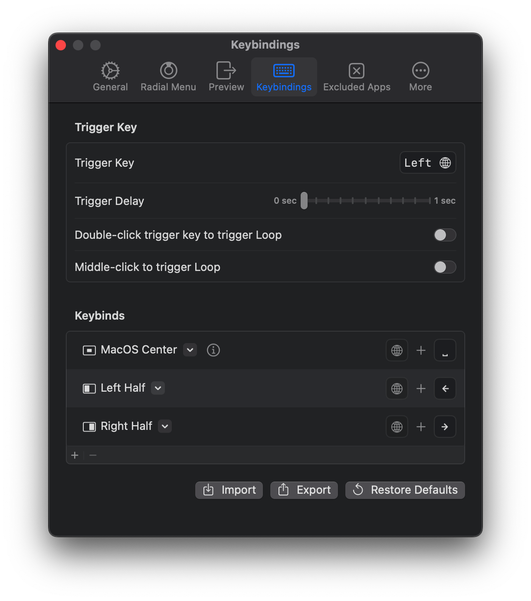
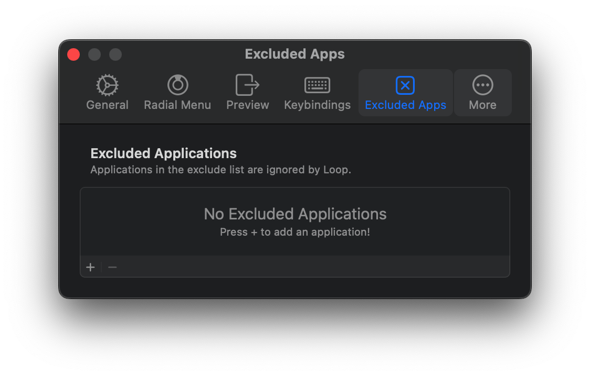
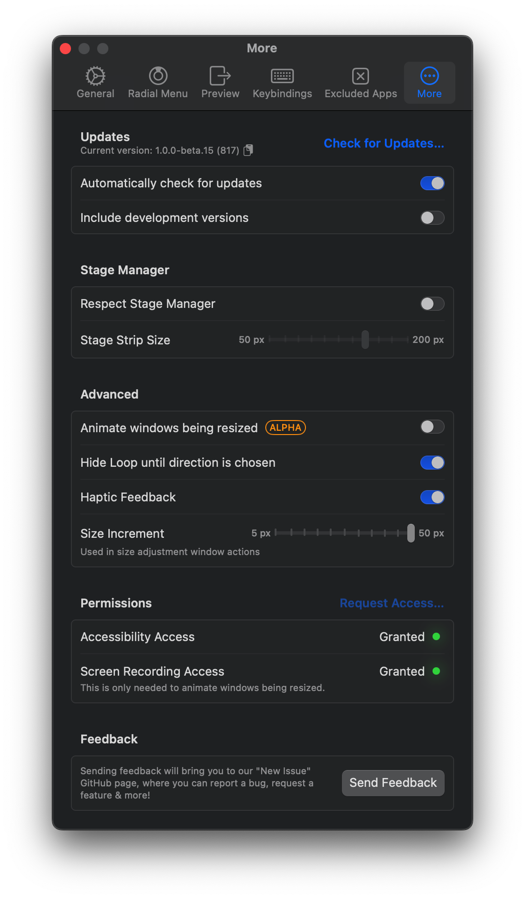

based on 1.0.0-beta.15 (817) ^ Apr 8, 2024

https://github.com/MrKai77/Loop
#### General

* Behavior
	* Window Snapping
	  
	* Window Padding
	  
	* Restore window frame on drag
	  窗口从Loop分配的位置拖离时，恢复到原先大小
* Accent Color
  配色。系统强调色就挺好看的。
#### Radial Menu

* Appearance
	* Disable cursor interaction
	  禁用光标交互
	* Corner Radius
	  拐角半径
#### Preview

#### Keybindings

#### Excluded Apps

#### More
