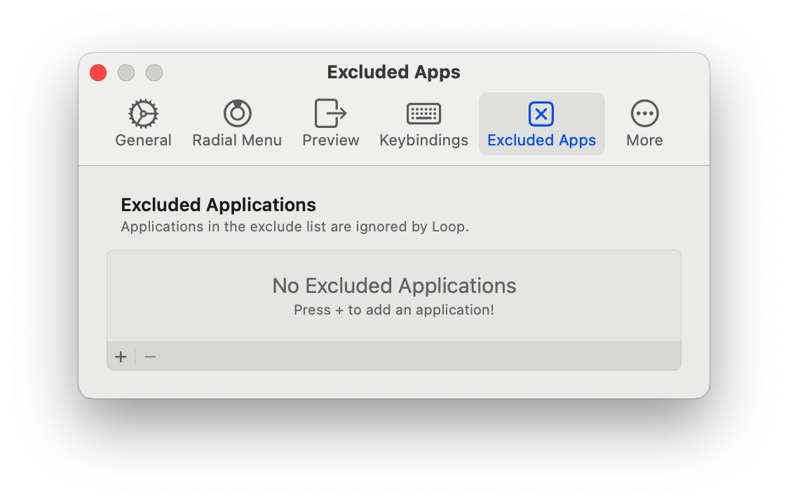

based on 1.0.0-beta.15 (817) ^ Apr 8, 2024

https://github.com/MrKai77/Loop
#### General

* Behavior
	* Window Snapping
	  通过贴靠屏幕边缘排列窗口。
	* Window Padding
	  可以自定义窗口之间的间隙，窗口与屏幕边缘的间隙等。默认即可。
	* Restore window frame on drag
	  窗口从Loop分配的位置拖离时，恢复到原先大小
* Accent Color
  配色。系统强调色就挺好看的。
#### Radial Menu

* Appearance
	* Disable cursor interaction
	  禁用光标交互
	* Corner Radius
	  拐角半径
#### Preview

* Appearance
	* Padding
	  预览边框到屏幕边缘的距离
#### Keybindings

* Trigger Key
	* Trigger Key
	  触发键：选择地球仪键
	* Middle-click to trigger Loop
	  使用鼠标中键触发Loop
#### Excluded Apps

* Excluded Applications
  豁免程序。被添加的程序将不接受Loop调节。
#### More

* Stage Manager
	* Respect Stage Manager
	  尊重前台调度（不用，所以不用尊重）
* Advanced
	* Animate windows being resized
	  窗口移动时的动画（目前感觉并不流畅，不用）
	* Hide Loop until direction is chosen
	  radial menu只会在光标移动时出现，如果只按trigger key则不会出现。
	  由于我设置了“按下地球仪键时，显示表情与符号”，所以还是很有用的。
	* Haptic Feedback
	  触感反馈。
	* Size Increment
	  Shrink/Grow时（见Keybindings Page），一次按键窗口增加/减少的像素值。