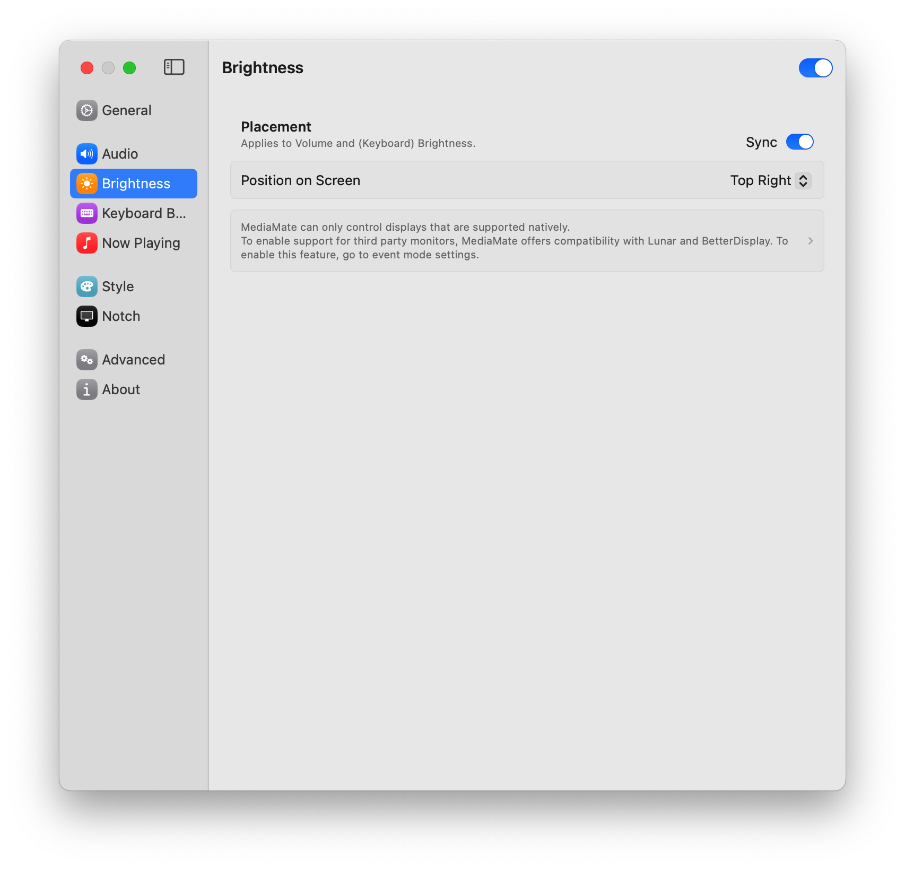

Based on 3.2.0 build 265 ^ Apr 9, 2024

https://wouter01.github.io/MediaMate/

### General

* Display Behavior
  不知道是啥。好像没啥影响。有知道的请务必联系我(WX:pacman_Syyu QQ:2166318849)。
* Focus Filters
  专注模式下也可用。

### Audio

PS: 如果想使用功能键调节声音，请先开启General - Event Controller Mode - Keyboard
* Placement - Sync
  开启，则各项调节的图标位置保持一致。修改也会同步。
* Sound
	* Play something when the volume is changed.
	  我的理解是，比如插入耳机后，由系统音量改为耳机音量，这种音量改变，如果出现了，会发出提示音提醒你。
	  但实际使用中没听到过。如果我理解的不对，请联系我(WX:pacman_Syyu QQ:2166318849)。

### Brightness

PS: 如果想使用功能键调节声音，请先开启General - Event Controller Mode - Keyboard

### Keyboard Brightness

### Now Playing

* 基本不用管。可以开启一下Hide Song Title Extras。

* 同样基本不用管，可以关闭一下When Playing Application is Active。
* When Locked
  在以下情况，锁定Now Playing，让其不会隐退。
### Style

开启All Displays，即在所有类型的屏幕（有Notch的部分Apple内置显示屏和无Notch的正常屏幕），设置相同的Style。
不开启，则可以对两种屏幕设置不同的Style。即点击With Notch，选择一种Style；点击Without Notch，选择一种Style。

* System HUD
	* Two Finger Drag to Change Value
	  体验不是很好。DPI太低了。而且本身也没有多方便。
	* Contrast
	  调节动画背景的深浅。尝试一下就知道了。
	* Bordered
	  有边框的。事实上几乎没有差别。
	* Transition
	  出场动画效果。默认最好看。

* Now Playing
  With Notch Screen，Notch Style更好看一点（Classic风格的Now Playing隐退时，会被原生Notch挡住一部分，也有点难受）
  Without Notch Screen，Classic Style更好看一点（模拟的Notch和外接显示器菜单栏颜色不同，就有点突兀）。
  ~~但如果两种屏幕分别设置，使用外接显示器时，不论哪个窗口是当前活跃的窗口，两个屏幕都会弹出Now Playing，又有一点小乱哈哈哈。仁者见仁，智者见智吧。~~(在Notch中关闭Always Show on Screen with Notch就解决了。果然强迫症不止我一个hhh)
	* Artwork Shadow
	  Now Playing的外观。可以尝试一下，个人感觉No最顺眼。
	* Expanded View
	  点击Now Playing后，会将它放大（不喜欢这个功能，因为放大后图片很糊。我倒希望有个开关可以把这个功能整个关掉）
		* Show Media Controls
		  开启，放大视图下方会显示一个播放控制台。
		* Show Application Shortcut
		  在放大视图的图片左下角显示一个小小的应用图标。
	* Dynamic Width
	  开启的话，名字太短时，Now Playing就很小。但自定义的话，Now Playing是大了，但又有很多空白。
	* Scaling
	  Now Playing的 长 宽 比例。默认就不错。
### Notch

* Show Close Button on Hover
  悬停时显示关闭按钮。虽然按钮不好看，但不碰Now Playing也不会显示。说不定有什么时候会用到呢。
* Always Show on Screen with Notch
  总是在带有Notch的屏幕上显示，关！
### Advanced

* Min/max Value Overshooting & Common Controls
  不知道是啥。有知道的请务必联系我(WX:pacman_Syyu QQ:2166318849)。
* Compact HUD Inset
  system huds 与显示器边缘的距离。

